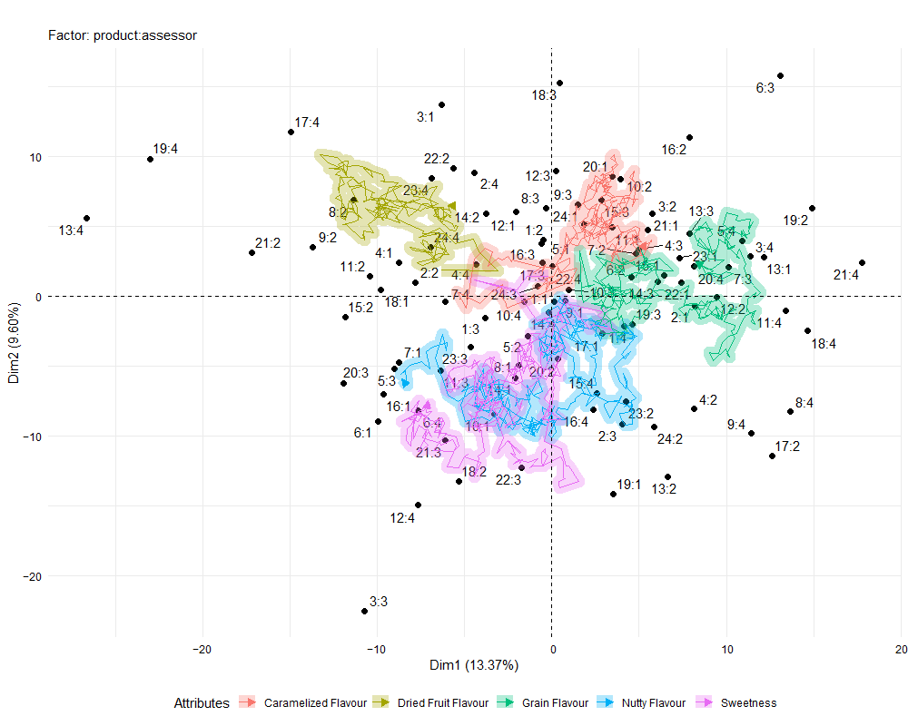
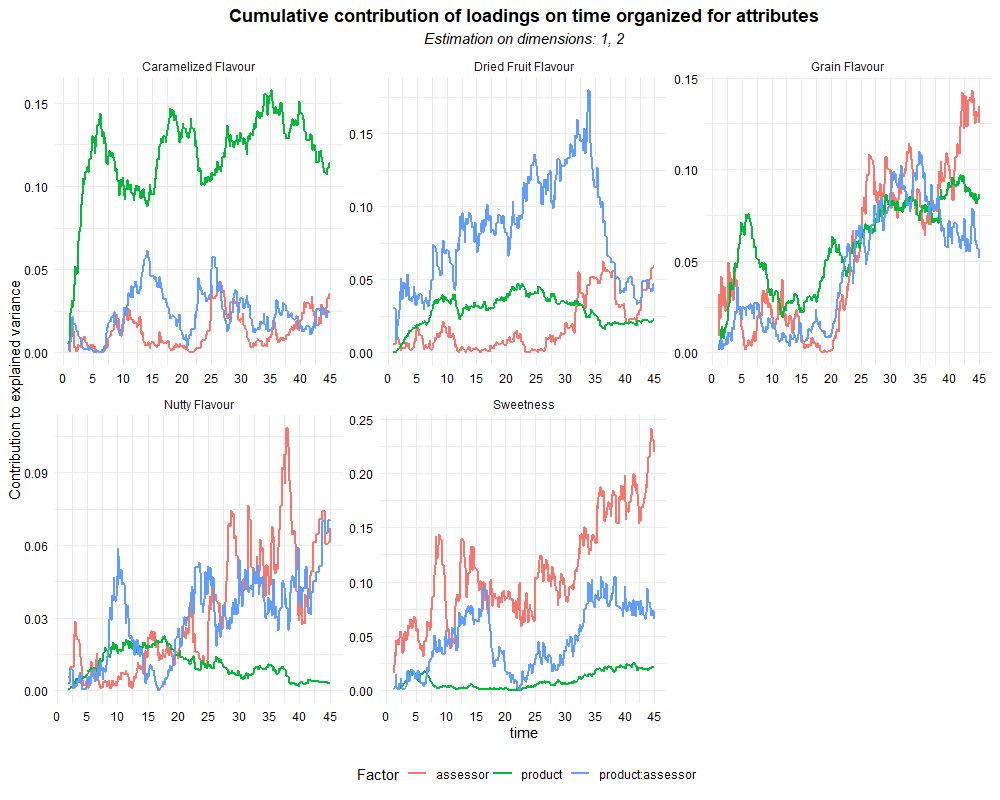
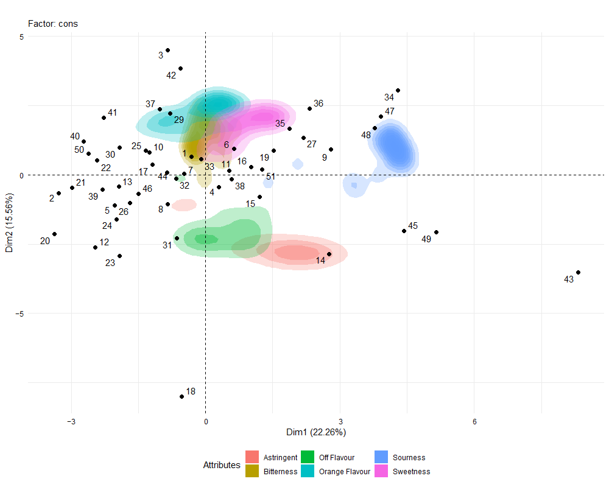
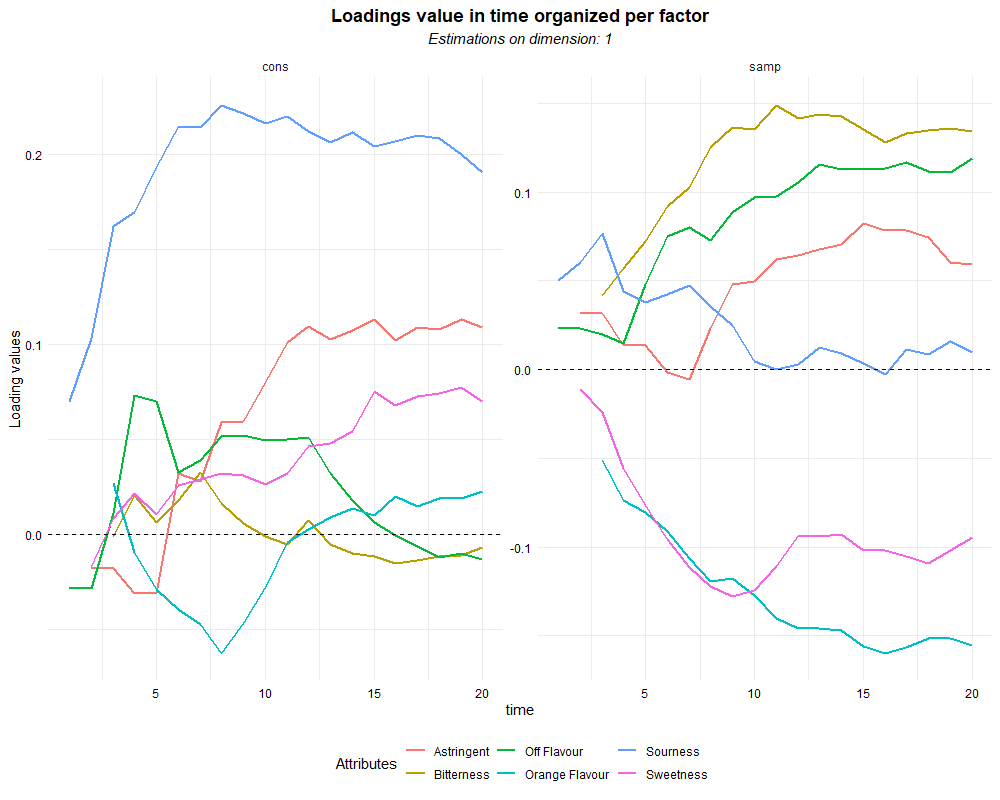
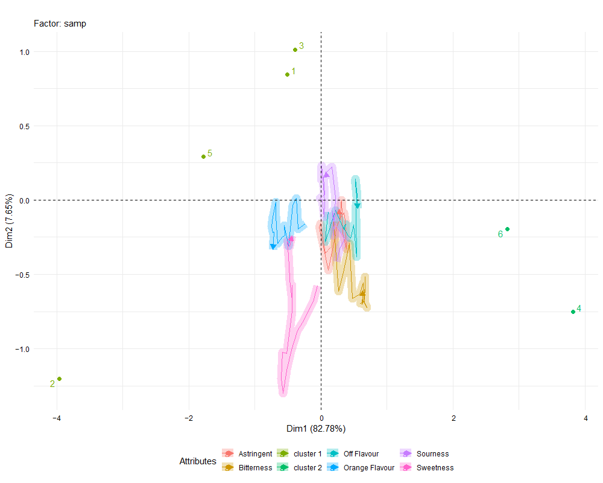

# ASCATCATA package

<!-- badges: start -->


<!-- badges: end -->

The package ASCATCATA offers a set of functions to apply, interpret, and report multivariate ASCA (ANOVA-Simultaneous Component Analysis) analysis on Dynamic Sensory Analysis data.

## Installation

You can install the development version of ASCATCATA like so:

``` r
library(devtools)
devtools::install_github("riccim94/ASCATCATA")
```

## The functions available

The ASCATCATA package offers a main function to apply an ASCA decomposition on datasets from dynamic sensory analysis and offers a set of functions to plot, interpret, and validate the results of the analysis. The decomposition applied consists of assuming a Gaussian distribution after applying a unit scale normalization to the interval considered. The decomposition is applied for each combination of unit of time and, when available, sensory attributes asked. 

The package offers a set of functions to analyze three different kinds of dynamic sensory analysis:
* asca_ti: To analyze data from Time Intensity (TI) analysis
* asca_tds: To analyze data from Temporal Dominant Sensation (TDS) analysis.
* asca_tcata: To analyze data from Temporal Check All That Apply (TCATA) data.

  ***

### asca_ti
This function applies ASCA decomposition to a Time-intensity (TDS) dataset. It is required that the dataset is put in a long format. The decomposition applied is based on the assumption of a normal data distribution. Each decomposition is applied to each unit of time.  

``` r
#first of all a dataset of Time Intensity data is used. An open Time Intensity is taken from the website https://help.xlstat.com/dataset/time-intensity-data_0.xlsm
library(readxl)
library(httr)
library(tidyverse)
url1 <- "https://help.xlstat.com/dataset/time-intensity-data_0.xlsm"

GET(url1, write_disk(tf <- tempfile(fileext = ".xlsm")))
tf <- str_replace_all(tf, "\\\\", "//")
data <- read_excel(tf)
data.long <- data %>% gather(time, intensity, 6:36) %>% filter(time != "0") %>% droplevels()
#the function is then applied on the dataset, defining the formula applied by the ASCA decomposition and the column containing the time column
test_ti <- asca_ti(intensity ~ PANELIST+PRODUCT, data = data.long, timecol = "time")
```
The package also offers two functions that report the data in visual graphical devices. The first is plot_ASCA() function

``` r
plot_ASCA(test_ti)
```


The second is plot_time_loadings().
``` r
plot_time_loadings(test_ti)
```


### asca_tds
This function applies ASCA decomposition to a Temporal Dominant Sensation (TDS) dataset. It is required that the dataset is put in long format. The decomposition applied is based on the assumption of a normal distribution of the data. Each decomposition is applied to each combination of units of time and sensory descriptors.  


``` r
# The first step consists of wrangling the dataset to put it in a long format
# and to mutate in factors the columns "cons" and "samp", and in numeric the column time
data <- tempR::bars
data.long <- data %>% gather( time, CATA, 5:455) %>% mutate(time = str_remove(time, "time_") %>% str_remove(., "s$"))

```
Once the dataset is arranged in long format with a column for the time values and a column for the attribute values, then we apply time-resolved ASCA decomposition on the dataset using the function asca_tds().

``` r
test_tds <- asca_tds(CATA~(sample+assessor)^2, data = data.long, timecol = "time", attributes = "attribute")
```

The results can be reported using the plot_ASCA function.

``` r
plot_ASCA(test_tds)
```




It is possible to select different arrangements for the depiction of loading values specifying the different parameters of the plot_ASCA() function.

It is possible to plot the contribution of each attribute on the overall variability for each factor adopting the function plot_time_loadings()

``` r
plot_time_loadings(test_tds)
```




### asca_tcata
``` r
library(ASCATCATA)
library(tempR)
library(tidyverse)
## basic example code
```

``` r
# The first step consists of wrangling the dataset to put it in a long format
# and to mutate in factors the columns "cons" and "samp", and in numeric the column time
data <- tempR::ojtcata
data.long <- data %>% gather(time, CATA, 5:25) %>%
mutate(cons = as.factor(cons), samp = as.factor(samp),
time = as.numeric(str_extract(time, "\\d+")))

# then we apply time-resolved ASCA decomposition on the dataset.
```

``` r
ASCA_T1 <- ASCATCATA::asca_tcata(CATA ~ cons+samp, data = data.long, timecol = "time", attributes = "attribute")
```

``` r
# The results can be represented using biplots adopting the plot_ASCA() function.

ASCATCATA::plot_ASCA(ASCA_T1)
```


``` r
# There are multiple display options available to show the loading values

ASCATCATA::plot_ASCA(ASCA_T1, density = T, path = F,, path.smooth = F)
```




``` r
# To estimate the variability along time of the attributes we can use the function plot_time_loadings.

#In its standard formulation, this function plots the contribution during time of each attribut organized by factor or organized by individual attribute.

ASCATCATA::plot_time_loadings(ASCA_T1)
```


``` r
#The same function can also plot the loading values risolved by time for one axes at time.
ASCATCATA::plot_time_loadings(ASCA_T1, choice = "loadings")

``` 




``` r
# The function plot_ASCA allows also to apply a hierarchical clustering for the results of the hierarchical clustering and reports the results.

ASCATCATA::plot_ASCA(ASCA_T1, h_clus = 2)
```





#### loadings.time.structure
The parameter loadings.time.structure in the function asca_tcata() is set by default to "long". if the input is switched to "short" the multivariate analysis of the factors levels of ASCA will be done with a different arrangement. The loading values estimated will be a single value, and the scores will be estimated for each combination of time units and levels of the factors considered.

``` r
ASCA_T2 <- ASCATCATA::asca_tcata(CATA ~ cons+samp, data = data.long, timecol = "time", attributes = "attribute", loadings.time.structure = "short")
```

The function plot_ASCA() will plot the results adopting a different plot structure to represent properly the results.

``` r
plot_ASCA(ASCA_T2)
```


#### time.quantization
The time.quantization parameter allows the quantization of the time units. The number reported consists in defying the number of time units which are required to be incorporated in singular time units. All the other operations would be the same, and the functions plot_ASCA() and plot_time_loadings() would function in the same way, reporting values for aggregated estimation of ASCA decomposition

#### residuals versus fitted
In the object is reported data.frame containing all the residuals and fitted values estimated by each ANOVA decomposition applied and the correspondent time unit and attribute.

#### Sum of squares estimation
In the object is reported data.frame containing the percentage of the Sum of Squares attributed to each factor and to residuals at aggregate levels.

``` r
ASCA_T1$SS_decomposition
```

Factor | Sum_Sq 
--- | ---
Residuals | 0.687 
cons | 0.239 
samp | 0.0740 


## Author

Michele Ricci, Ph.D.
ricci.michele94@gmail.com


