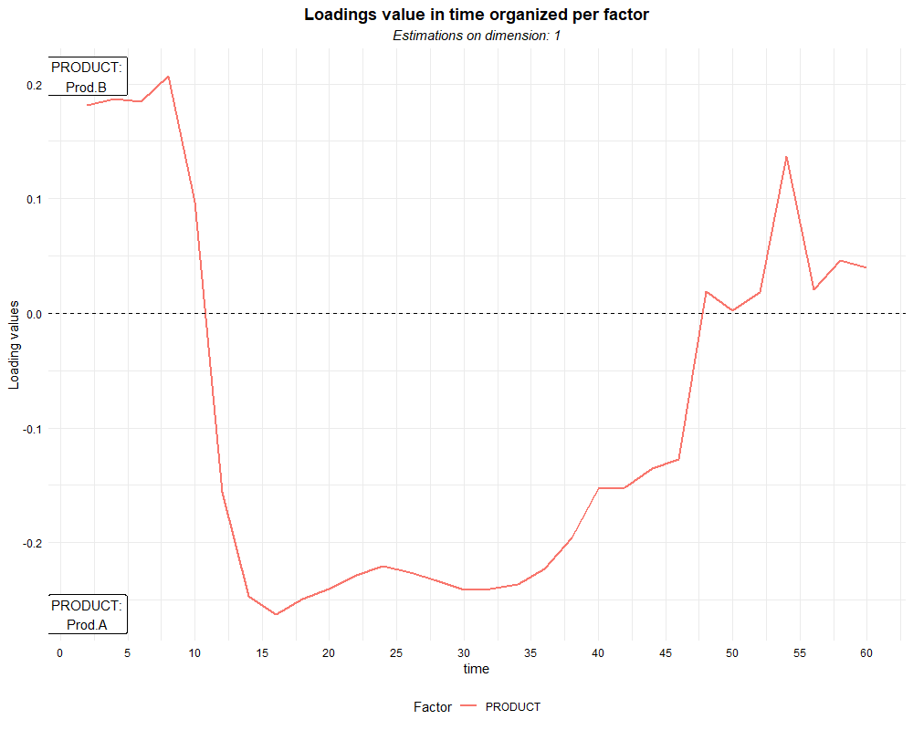
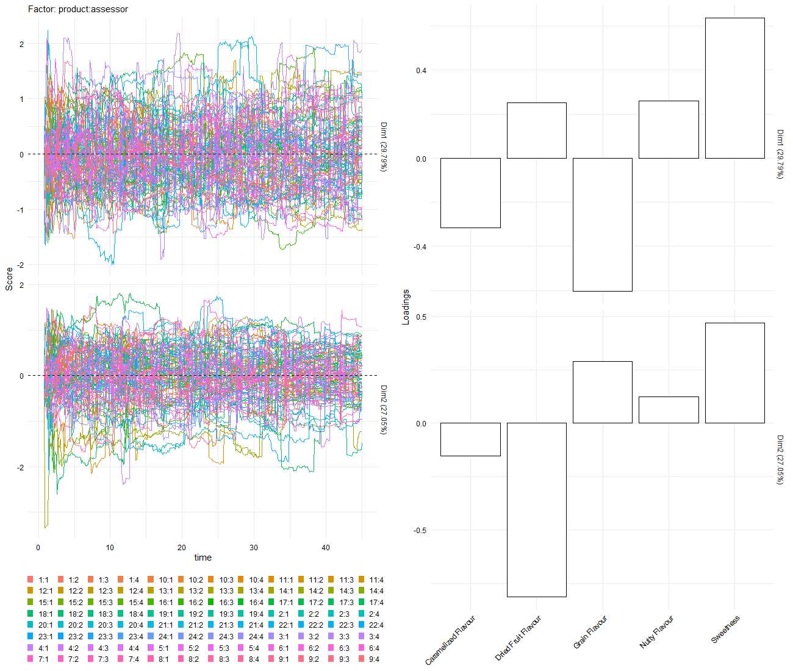
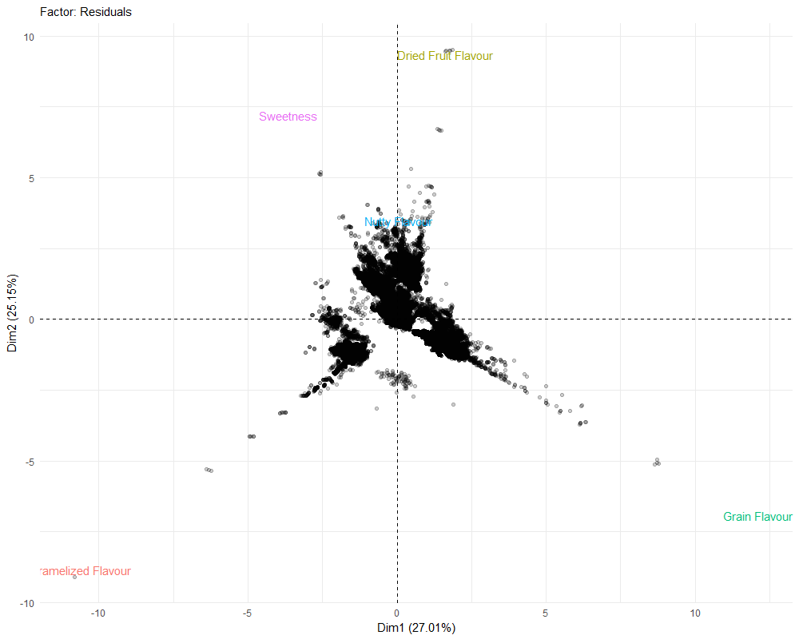
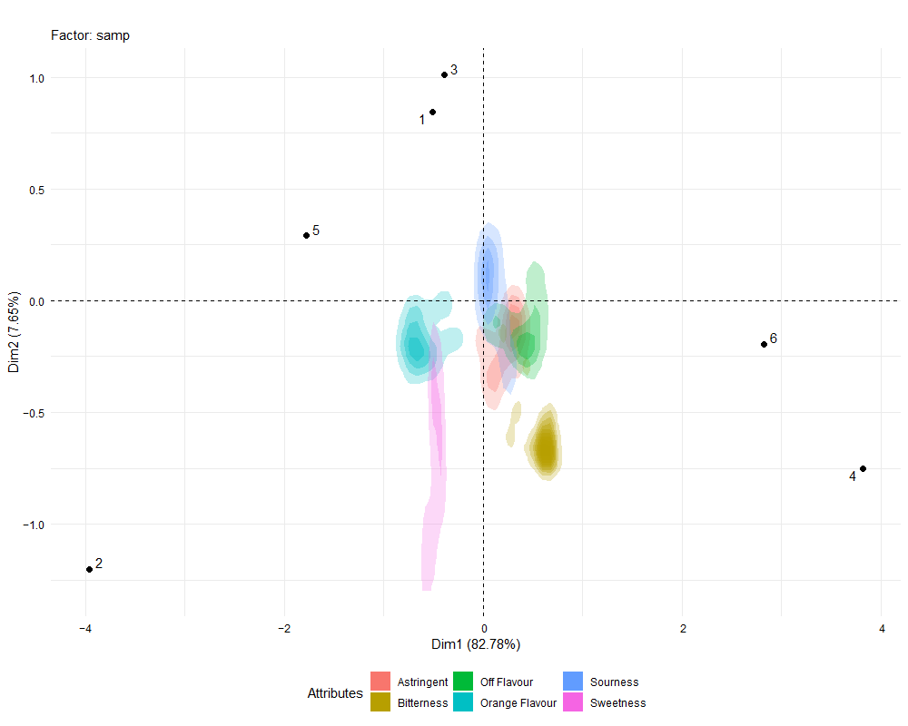
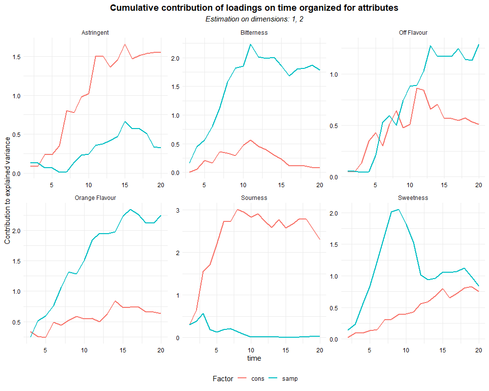
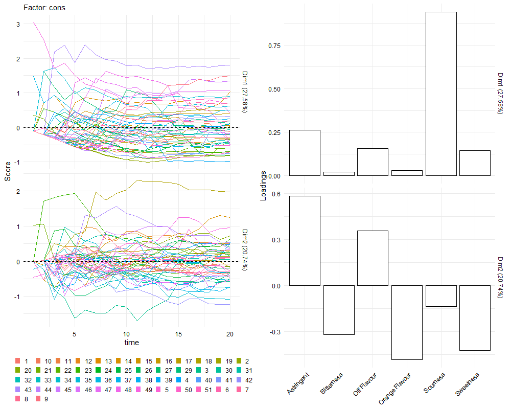
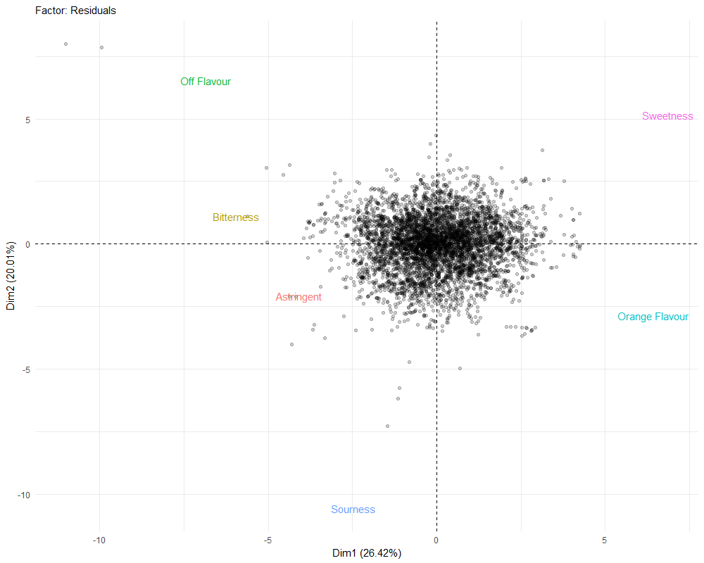

# ASCATCATA package

<!-- badges: start -->


<!-- badges: end -->


The package ASCATCATA offers a set of functions to apply, interpret, and report multivariate ASCA (ANOVA-Simultaneous Component Analysis) analysis on Dynamic Sensory Analysis data.

## Installation

You can install the development version of ASCATCATA like so:

``` r
library(devtools)
devtools::install_github("riccim94/ASCATCATA")
```

## The package

The ASCATCATA package offers a main function to apply an ASCA (ANOVA-Simultaneous Component Analysis) decomposition on datasets from dynamic sensory analysis. It offers a set of functions to plot, interpret, and validate the analysis results.

ASCA analysis (Smilde et al. 2012) applies the same general linear model (glm) decomposition for each variable of the dataset at the time. In the present case, to deal properly with time-resolved datasets, the decomposition is applied for each combination of time unit and parameter available.
The glm decomposition is applied using an identity link function and assuming a Gaussian distribution of the residuals. The decomposition is applied to data after a unit scale normalization step.
From the decomposition applied to each sub-unit of the dataset, it is possible to estimate a coefficient for each level of all the factors included in the glm model.

After the application of the glm models, the next step is the construction of *n* matrices of dimension [*k*,*m*], where *n* is the number of factors included in the model, *k* is the number of levels of each factor respectively and *m* corresponds to the number of every combination of time and parameters where a glm decomposition was applied.
Then each matrix is centered column-wise and then it is treated by adopting a Principal Component Analysis (PCA). The final values are analyzed as a Principal Component Analysis (PCA), assigning score values to the levels of the factor considered, and loading values to the combination between time units and sensory descriptors. 

The information obtained from the ASCA framework consists of a multivariate comparison between the levels of a single factor, highlighting similarities and differences between multiple measurements of an experiment using the scores values. Furthermore, the analysis also estimates how each variable varies in relation to each factor, considering possible interaction effects.

In the context of dynamic sensory data, the ASCA framework proposed can be used for:
* The comparison of different conditions (i.e. different products, different judges, presence/absence or different levels of ingredients, different processing conditions), obtaining an individual score value estimated considering the whole time-series datasets available. The analysis reports also how the parameters (in the case of dynamic sensory analysis the sensory descriptors) vary over time according to the factors considered.
* The comparison of different conditions during time at multivariate levels, obtaining a time-resolved score value for each level of the factor considered. The analysis report also the loadings values that define how sensory descriptors vary.
* After a bootstrap test, the estimation of confidence intervals allows the estimation of significant differences between conditions at the multivariate level from ASCA models, and to estimate which loading values are significantly different from zero, to define the most important parameters that cause those differences.
* The multivariate distribution of residuals is an indicator of the significance of the model applied.
* The aggregate distribution of Sum of Squares values in ASCA models is an indicator of the explained variance by each factor included in the model and it is associated with the effect size of the factor.

The ASCATCATA package proposes the ASCA framework as a reliable tool to infer practical information from dynamic sensory datasets allowing the sensory researcher to extract summarizing information from structured datasets considering the issues related to the autocorrelated structure of time series and the effects of confounding factors.

 ***

## Functions available

The package offers a set of functions to analyze three different kinds of dynamic sensory analysis:
* asca_ti: To analyze data from Time Intensity (TI) analysis.
* asca_tds: To analyze data from Temporal Dominant Sensation (TDS) analysis.
* asca_tcata: To analyze data from Temporal Check All That Apply (TCATA) data.

For each function is reported and discussed the output obtained by applying the graphical tools contained in the functions plot_ASCA() and plot_time_loadings().

Finally, the use of the function perm_asca() for model validation and plot_perm() for the graphical representation.

### asca_ti
This function applies ASCA decomposition to a Time-Intensity (TI) dataset. It is required that the dataset is put in a long format. The decomposition applied is based on the assumption of a normal data distribution. Each decomposition is applied to each unit of time.  

``` r
# An open Time Intensity dataset is taken from the website https://help.xlstat.com/dataset/time-intensity-data_0.xlsm
library(readxl)
library(httr)
library(tidyverse)
url1 <- "https://help.xlstat.com/dataset/time-intensity-data_0.xlsm"

GET(url1, write_disk(tf <- tempfile(fileext = ".xlsm")))
tf <- str_replace_all(tf, "\\\\", "//")
data <- read_excel(tf)
data.long <- data %>% gather(time, intensity, 6:36) %>% filter(time != "0") %>% droplevels()
``` 
Here is reported a snippet of the data structure requested for launching the function.

``` r
data.long
# A tibble: 15 × 7
# >    ...1 PANELIST REPLICATE PRODUCT `TIME(S)` time  intensity
# >   <dbl> <chr>        <dbl> <chr>   <chr>     <chr>     <dbl>
# > 1     1 Judge.A          1 Prod.A  sample1   0           0  
# > 2     1 Judge.A          1 Prod.A  sample1   2          10.6
# > 3     1 Judge.A          1 Prod.A  sample1   4          20.9
# > 4     1 Judge.A          1 Prod.A  sample1   6          30.4
# > 5     1 Judge.A          1 Prod.A  sample1   8          40.7
# > 6     1 Judge.A          1 Prod.A  sample1   10         50.8
# > 7     1 Judge.A          1 Prod.A  sample1   12         60.4
# > 8     1 Judge.A          1 Prod.A  sample1   14         70.3
# > 9     1 Judge.A          1 Prod.A  sample1   16         80.6
# >10     1 Judge.A          1 Prod.A  sample1   18         90.1
# ℹ 734 more rows
# ℹ Use `print(n = ...)` to see more rows
``` 
For the correct functioning of the function, it is required that the time units are all defined in a separate column, and each factor included in the ASCA decomposition must be in its proper column.

> [!WARNING]
> For the correct application of ASCA decomposition, it is necessary that the same experimental design is replicated for each time unit.

``` r
#the function is then applied to the dataset, defining the formula applied by the ASCA decomposition and the column containing the time column
test_ti <- asca_ti(intensity ~ PANELIST*PRODUCT, data = data.long, timecol = "time")
```
After the estimations, the result of the function is a list containing as many pca objects as the number of factors and interactions included by the formula, another pca object for residuals, and a list called `info` containing information about the analysis.

The package also offers two functions that report the results of ASCA analysis using visual graphical devices. The first is the plot_ASCA() function, which plots an adapted form of biplot for time-structured loadings values.

> [!NOTE]
> To interpret this kind of plot, it is necessary to remember that this analysis reports relative values, referred to the structure of the dataset, that highlight the similarities and differences between the levels of the factors considered at the multivariate level.
> 
> For this reason, each point represents the aggregated results referred to a level of the factor considered. The position on the new-estimated dimension is calculated by estimating all the runs that were assigned to the levels of that factor, and, most importantly, estimating this value considering all the units of time collected from the runs. Consequently, each point represents an average of each value collected from all the information collected by the dynamic sensory procedure.
> 
> The loading values are represented by the path that begins near the center of the plot. The points forming the line represent the loading values estimated for each point of time of the dynamic sensory experiments in order. To interpret the loading values, it is necessary to check their alignment with each dimension, and considering that a higher loading value in a dimension represents that the dimension considered represents the similarities and differences of the levels in the time intervals of the experiments that have higher loading values.

``` r
#plot_ASCA(test_ti) #calling the function this way will plot all the plots available
plot_ASCA(test_ti, object = "PANELIST") # This will print only the biplot for panelist
```


This plot is a bi-plot reporting the results of the ASCA analysis for the factor "PANELIST".

The present plot highlights that according to the first dimension, there is a strong difference between panelists due to a higher overall value reported by Panelists A, B, and C on the left side due to the intermediate and final time interval. 

According to the second dimension, there is a difference between panelists due to the overall intensity values that they gave at some specific time intervals, more precisely, at the time interval from 50 to 54, when the panelist in the lower part of the plot (C and E) gave higher values on average compared to the others. Panelist A gave values lower than the average for these values and values higher than the average in the time units 46, 56, and 60. 

The two dimensions explain 89% of the overall variance between the levels of this factor, consequently, already an important percentage of the variance is reported by this plot, if necessary it is possible to depict the other dimension by specifying in the parameter `dimensions` the number of the dimension desired.

The results contained in the first plot report that the largest fraction of the differences between the panelists is related to a specific interval of time and that there are panelists that are similar in this behavior.

``` r
plot_ASCA(test_ti, object = "Product:PANELIST") # This will print only the biplot for the interaction between the product and panelist.
``` 


> [!NOTE]
> In the default "long" loadings structure, the function plot_ASCA() can plot only factors with more than two levels. A warning signal will be displayed in case of an attempt. To plot information for two levels factors check for the functions plot_time_loadings().

In this plot, there are reported similarities and differences considering the interaction of the two factors.

In this case, the score values represent the aggregated values considering all the possible combinations of the levels of two factors available in the dataset. The comparison between those points indicates how much each level of a factor changes when it is estimated with another factor at the same time. In the case of a sensory experiment, at least two factors (panelist, product, repetition) are probably affecting the final response, and it is necessary to consider if there is a modification of the effect due to an interaction between two or three factors. Considering them could be useful for controlling the overall behavior of the panel (by checking for outlier effects or detecting the presence of confounding factors) and to investigate the effects of specific interactions of factors of interest, in case of multiple factors affecting the product or the panelist behavior (i.e. the presence of multiple ingredients and their combination, the different demographic of the panel).

This plot can be interpreted in a similar way to the previous one, but it is necessary to consider the different meanings of the score values, which in this case refer to the combination of a panelist and a product. The similarities and differences highlighted in each dimension correspond to the differences due to the variation of the answer of each judge with different products.

In the first dimension of this plot, the answers of each judge are separated into two different sides, highlighting how the differences due to the products are more influential than the differences between judges in 81% of the explained variance. The second dimension separates only 4 points from the average values, highlighting how the answers of the judges were different due to another portion of the time span of the questions. The judges considered in this dimension are Judge.A and Judge.B.

Furthermore, there are other graphical displays available in the function that can be used to improve graphical representation. Modifying the values of **density**, **path**, **path.smooth**, and **time.label** parameters it is possible to modify the aesthetic of the plot. 

``` r
plot_ASCA(test_ti, object = "PANELIST", path = FALSE, time.label = 10) # This function displays the same biplot as before, but instead of the solid line, loadings are represented only by the smooth line and numbers indicating the time units.
# The number inside the time.label parameter indicates how many time units are excluded between one value and another.
``` 


The second graphical function available is plot_time_loadings(). It prints a series of line plot that shows the same loading values reported by the plot_ASCA() function organized per time.
The resulting plot compares loading values along time between different factors, highlighting which time points are affecting the most the differences between levels.

``` r
plot_time_loadings(test_ti)
```


The "contribution" index refers to the contribution to the overall variance for the dimensions considered, and it is calculated in the same procedure used by the function `fviz_contrib` contained in the `factoextra` package (Kassambara & Mundt 2020).
This index indicates the percentage of the contribution of the loadings in a specific time unit to the definition of the principal components (Kassambara, 2017). 

This plot conveys two kinds of information: which time intervals are most significant for differentiating between different levels of a single factor. This information is reported by each individual line, and higher values at certain time intervals mean that the estimation of the model is inferred mostly from the differences detected in those intervals of time. The second information conveyed by this plot is the comparison of the contribution levels between different factors, estimated by comparing the plot's lines of different colors. This highlights how the differences estimated within different factors are different: the differences are not only due to different intensity values but also to the moments when those differences occur in the analysis.

It is possible to define which are the dimensions considered specifying in the object `dimensions` the number corresponding to the dimension of interest.
The information reported highlights for each factor to which time interval the differences between the levels detected using the previous plot are due.

This function can compare the loading values directly, one dimension at a time, defining the value "loadings" in the `choice` parameter of the function. This representation permits a better understanding of the results displayed using the function plot_ASCA and a direct comparison between different factors for the interpretation of the results.

``` r
plot_time_loadings(test_ti, choice = "loadings")
```


This function is also necessary for the interpretation of ASCA decomposition in case of factors that have only two levels. In this case, the function plot_ASCA() has been disabled, because a two-dimensional algorithm can not report properly the information. A line plot that contains information related to a single index and time can better highlight the differences between the two levels.

To help the information, automatically the plot will print labels reporting the name of the two levels of interest when the plot_time_loadings() function is applied on an ASCA decomposition of a two-level factor, by specifying TRUE in the parameter `lab_two_lvl`.

``` r
plot_time_loadings(test_ti, choice = "loadings", object = "PRODUCT", lab_two_lvl = TRUE)
# "object" parameter defines from which factor's decomposition the loadings factors will be depicted. It can be a string containing the name of the factor or a number.
# "lab_two_lvl" indicates whether or not the labels related to the two levels of the factors will be depicted.
```



The plot indicates in which intervals of time there are overall higher values for one level or another. It allows to compare the overall response at a multivariate level in the case of reduced dimensions.

### asca_tds
This function applies ASCA decomposition to a Temporal Dominant Sensation (TDS) raw dataset. the function is applied to the 0 and 1 raw datasets, without any prior preprocess besides the wrangling of the structure of the data.frame.
In this case, the ASCA decomposition is applied for every combination of time units and sensory descriptors applied, and the glm model is applied using an `identity` link function and assuming a normal distribution of the residuals after a unit scales normalization.

``` r
# The first step consists of wrangling the dataset to put it in a long format
# and to mutate in factors the columns "cons" and "samp", and in numeric the column time
data <- tempR::bars
data.long <- data %>% gather( time, CATA, 5:455) %>% mutate(time = str_remove(time, "time_") %>% str_remove(., "s$")) %>% rename(product = sample)
```

The dataset structure required consists of a long format, with one column containing the time units, one column indicating the different sensory parameters considered, one having all the 0 and 1 values, and as many columns as are the factors and interactions considered in the experimental design. A snippet of a valid data.frame structure is reported below.

The name change of the factor `sample` to `product` is applied for interpretability's sake, because the term "sample" can be attributed erroneously to a single observation, while in this case the experiment report multiple observation on different recipes of bars, each defined as "product". The overall structure of the dataset it is not affected.

> [!NOTE]
> For the correct functioning of the functions, it is necessary that the time column defined in `timecol` does not have any alphabet characters or symbols.

``` r
data.long
# A tibble: 649,440 × 6
# >   assessor session product attribute           time   CATA
# >      <int>   <int>  <int> <fct>               <chr> <int>
# > 1        1       1      1 Caramelized Flavour 0.0       0
# > 2        1       1      1 Dried Fruit Flavour 0.0       0
# > 3        1       1      1 Grain Flavour       0.0       0
# > 4        1       1      1 Nutty Flavour       0.0       0
# > 5        1       1      1 Sweetness           0.0       0
# > 6        1       2      1 Caramelized Flavour 0.0       0
# > 7        1       2      1 Dried Fruit Flavour 0.0       0
# > 8        1       2      1 Grain Flavour       0.0       0
# > 9        1       2      1 Nutty Flavour       0.0       0
# >10        1       2      1 Sweetness           0.0       0
# ℹ 649,430 more rows
# ℹ Use `print(n = ...)` to see more rows
```

Once the dataset is arranged in long format with a column for the time values and a column for the attribute values, we apply time-resolved ASCA decomposition on the dataset using the function asca_tds().

``` r
test_tds <- asca_tds(CATA~(product+assessor)^2, data = data.long, timecol = "time", attributes = "attribute")
```

The results can be reported using the plot_ASCA function. Calling the function with only the object obtained from the asca_tds() function will print one bi-plot for each factor plus one other bi-plot for residuals. It is possible to call one plot at a time specifying a number or a string containing the exact name of the factor as reported in the formula.

``` r
#plot_ASCA(test_tds) This will print all the plots one after the other.

plot_ASCA(test_tds, object = 1)
# plot_ASCA(test_tds, object = "product") This has the same result
```


The interpretation of this biplot is similar to the biplot obtained from the asca_ti() function, but there are important differences.
The score values have a similar meaning because they represent the aggregated values of all the measurements collected at that same level, and they are estimated considering all the time units of the dynamic sensory analysis, the loading values are more complex because they are estimated considering all the combinations of sensory attributes and time units, consequently there are multiple trails representing the multiple sensory descriptors asked. This representation compares how the different definitions of multiple attributes at the time caused a differentiation between the measurements collected between different levels of a factor, which can be the two different judges, two different products, or other variations considered in the model. 

The interpretations of the loadings values can be effected properly considering that the correlation between score and loadings values means that there is an overall higher occurrence of selection of a specific sensory attribute in that interval of time in the TDS runs done having that specific level comparing to the levels that are negatively or not correlated with the loading value considered. at an aggregated level, the trails of loadings that move from the center of the plot to a side of the plot indicate the area of the plot that contains the levels with higher levels for specific sensory descriptors during their whole time interval. On the contrary, the trails that move from the center to one side of the plot and then another one indicate that sensory descriptors there are no constant differences in the occurrence of the prominence of sensory descriptors in a single group of levels, therefore there could be only certain portion of time which are significant for the dimensions considered or there are no significant time portions at all.

In this specific case, the first dimension separates the products according to the attribute

``` r
plot_ASCA(test_tds, object = 2)
# plot_ASCA(test_tds, object = "assessor") This has the same result
```


``` r
plot_ASCA(test_tds, object = 3)
# plot_ASCA(test_tds, object = "product:assessor") This has the same result
```


In this case, it is important to highlight that the factor depicted is actually the interaction between two factors, consequently, each point defining score values describes part of the answers attributed to a product according to the assessor tasting it. Considering that each product has been evaluated 3 times by each assessor, each point aggregates multiple time series.

``` r
plot_ASCA(test_tds, object = 4)
# plot_ASCA(test_tds, object = "Residuals") This has the same result
```


This plot represents the distribution of the residuals estimated from glm decomposition. This plot is available to evaluate if there are evident structures in the residuals at the multivariate level, to estimate if a significant factor was not considered, or if there is some outlier value that behave in a completely different way compared to the other values.

To estimate this it is necessary to evaluate the correlation structure between loadings attributes to different sensory descriptors and observe the presence of outliers in the scores values, or score values that are not related to a bivariate normal structure.

It is possible to select different arrangements for the depiction of loading values specifying the different parameters of the plot_ASCA() function. By defining a number or the name of the factor in **object** it is possible to select which plot will be printed. Modifying the values of **density**, **path**, **path.smooth**, and **time.label** parameters it is possible to modify the aesthetic of the plot.

``` r
plot_ASCA(test_tds, object = 1, path = FALSE, time.label = 100)

```


This graphical representation adds time unit values to the plot, it is necessary to pay attention to the choice of the right interval to avoid plotting an excessive amount of time labels. This representation compares the time structure of the loading values.


``` r
plot_ASCA(test_tds, object = 1, density = TRUE, path = FALSE, path.smooth = FALSE)

```


The values reported here are the same as the plot above. This depiction is suggested only if it is not necessary to report information about the time structure, but only about the attributes. May be useful to summarize the differences due to the overall use of sensory descriptors.

In the function asca_tds is available a parameter called `loadings.time.structure` that changes the estimation of the ASCA model modifying the loading structure while maintaining the same procedure for the glm decomposition step.
If the value attributed to `loadings.time.structure` is changed from "long" (default value) to "short", another list object will be created, containing a series of objects having the same names, but with important differences in all the `prcomp` objects. The difference consists in the fact that the loading values will be only one for each sensory descriptor, while the score values will be estimated for each combination between the levels of the factor considered and the time unit of the dataset. Consequently, in this case, the results compare multiple values for each level, as many as the number of time units, knowing that the different values are related to the overall amount of time that a specific descriptor was defined or wasn't defined as prominent. Which descriptors are defined is reported by the loading values.

``` r
test_tds_short <- asca_tds(CATA~(product+assessor)^2, data = data.long, timecol = "time", attributes = "attribute", loadings.time.structure = "short")

```
The object created by this function is a list containing as many PCA object (as estimated by `prcomp()` function) as the number of factor and interactions indicated in the formula, and another PCA object for the residual structure.


``` r
plot_ASCA(test_tds_short, object = 1)
```


``` r
plot_ASCA(test_tds_short, object = 2)
```


``` r
plot_ASCA(test_tds_short, object = 3)
```



``` r
plot_ASCA(test_tds_short, object = "Residuals")
```



It is possible to plot the contribution of each attribute on the overall variability for each factor by adopting the function plot_time_loadings()

``` r
#plot_time_loadings(test_tds) #this format will print two plots in succession
plot_time_loadings(test_tds, ref = "attributes") # print the results organized in different colors according to the attribute and different panels according to the factor
```


``` r
#plot_time_loadings(test_tds) #this format will print two plots in succession
plot_time_loadings(test_tds, ref = "factors") # print the results organized in different colors according to the factor and different faceting panels according to the attributes
```


### asca_tcata
This function applies ASCA decomposition to a Temporal Check-All-That-Apply (TCATA) raw dataset. The function is applied to the 0 and 1 raw datasets, without any prior preprocessing besides the wrangling of the structure of the data.frame.
Similarly to previous cases, the ASCA decomposition is applied for every combination of time units and sensory descriptors applied, and the glm model is applied using an `identity` link function and assuming a normal distribution of the residuals after a unit scales normalization.
The procedure of TCATA allows the collection of a more dense dataset than TDS, and the estimation of multiple other parameters is possible.

``` r
library(ASCATCATA)
library(tempR)
library(tidyverse)
## basic example code

# The first step consists of wrangling the dataset to put it in a long format
# and to mutate in factors the columns "cons" and "samp", and in numeric the column time
data <- tempR::ojtcata
data.long <- data %>% gather(time, CATA, 5:25) %>%
mutate(cons = as.factor(cons), samp = as.factor(samp),
time = as.numeric(str_extract(time, "\\d+")))
```
The present case required some string manipulation in the column referred to time because initially there were multiple alphabet characters in the time column that interfered with the function.
Here is a snippet of a data.frame that has the right structure for the function:

``` r
data.long
# A tibble: 37,800 × 6
# >   cons  samp  samp_pos attribute       time  CATA
# >   <fct> <fct>    <int> <fct>          <dbl> <int>
# > 1 1     1            1 Astringent         0     0
# > 2 1     1            1 Bitterness         0     0
# > 3 1     1            1 Off Flavour        0     0
# > 4 1     1            1 Orange Flavour     0     0
# > 5 1     1            1 Sourness           0     0
# > 6 1     1            1 Sweetness          0     0
# > 7 1     2            3 Astringent         0     0
# > 8 1     2            3 Bitterness         0     0
# > 9 1     2            3 Off Flavour        0     0
# >10 1     2            3 Orange Flavour     0     0
# ℹ 37,790 more rows
# ℹ Use `print(n = ...)` to see more rows
```

Once the dataset has been properly wrangled, the ASCA decomposition can be applied using the asca_tcata() function.

``` r
# Apply time-resolved ASCA decomposition on the dataset.
ASCA_T1 <- ASCATCATA::asca_tcata(CATA ~ cons+samp, data = data.long, timecol = "time", attributes = "attribute")
```

The resulting object is a list containing multiple objects:
* **cons**: A PCA object (as estimated by `prcomp` function) for the first factor defined in the formula of the function.
* **samp**: A PCA object (as estimated by `prcomp` function) for the second factor defined in the formula of the function.
* **Residuals**: A PCA object estimated from the residual matrix obtained from the combination of all the residuals matrices from every glm model estimated.
* **info**: A list containing information about the model. The information reported are: whether the structure of the loadings is "long" or "short", the type of dynamic sensory data considered by the function used, the individual time units, the attributes' name, the formula used by the model, and the names of the column from which the time units and the names of the attributes are estimated from in the original dataset.
* **Parameters**: A data.frame containing all the raw fitted values and the residuals estimated from all the glm decomposition of the model.
* **SS_decomposition**: A data.frame containing the values of the aggregated sum of squares estimated for each factor and interaction included in the model. 

The list contains as many PCA objects from the decomposition of factors as the number of factors and interactions are defined in the formula of the `asca_tcata()` function.

The results can be represented using biplots adopting the plot_ASCA() function, as shown below.

``` r
ASCATCATA::plot_ASCA(ASCA_T1, object = 1)
```


``` r
ASCATCATA::plot_ASCA(ASCA_T1, object = 2)
```


``` r
ASCATCATA::plot_ASCA(ASCA_T1, object = "Residuals")
```


``` r
# There are multiple display options available to show the loading values

ASCATCATA::plot_ASCA(ASCA_T1, density = TRUE, path = FALSE,, path.smooth = FALSE, object = 1)
```


``` r
ASCATCATA::plot_ASCA(ASCA_T1, density = TRUE, path = FALSE,, path.smooth = FALSE, object = 2)
```



``` r
# To estimate the variability along time of the attributes we can use the function plot_time_loadings.

#In its standard formulation, this function plots the contribution during the time of each sensory attribute of the experiment organizing the plot in different faceting panels by each factor or by individual attribute.

#plot_time_loadings(ASCA_T1) # this command will print two plots in succession
plot_time_loadings(ASCA_T1, ref = "attributes") # Each line has a different color for each sensory descriptor asked and the values are divided in faceting panels according to the factor and the interactions included in the model.
```


``` r
plot_time_loadings(ASCA_T1, ref = "factors") # Each line has a different color for each factor included in the model, and the values are divided into faceting panels according to the sensory attributes of the experiment
```


``` r
#The same function can also plot the loading values resolved by time for one dimension at time.
#plot_time_loadings(ASCA_T1, choice = "loadings")
plot_time_loadings(ASCA_T1, choice = "loadings", ref = "attributes")

``` 


``` r
plot_time_loadings(ASCA_T1, choice = "loadings", ref = "factors")

```


``` r
# The function plot_ASCA allows also to apply a hierarchical clustering for the results of the hierarchical clustering and reports the results.

ASCATCATA::plot_ASCA(ASCA_T1, h_clus = 2)
```


#### loadings.time.structure
The parameter loadings.time.structure in the function asca_tcata() is set by default to "long". if the input is switched to "short" the multivariate analysis of the factors levels of ASCA will be done with a different arrangement. The loading values estimated will be a single value, and the scores will be estimated for each combination of time units and levels of the factors considered.

``` r
ASCA_T2 <- ASCATCATA::asca_tcata(CATA ~ cons+samp, data = data.long, timecol = "time", attributes = "attribute", loadings.time.structure = "short")
```

The function plot_ASCA() will plot the results adopting a different plot structure to represent properly the results.

``` r
plot_ASCA(ASCA_T2, object = 1)
#plot_ASCA(ASCA_T2, object "cons") gives the same result
```



``` r
plot_ASCA(ASCA_T2, object = 2)
#plot_ASCA(ASCA_T2, object "samp") gives the same result
```


``` r
plot_ASCA(ASCA_T2, object = 3)
#plot_ASCA(ASCA_T2, object = "Residuals") gives the same result
```



#### time.quantization
The time.quantization parameter allows the quantization of the time units. The number reported consists in defying the number of time units which are required to be incorporated in singular time units. All the other operations would be the same, and the functions plot_ASCA() and plot_time_loadings() would function in the same way, reporting values for aggregated estimation of ASCA decomposition

#### residuals versus fitted
In the object is reported data.frame containing all the residuals and fitted values estimated by each ANOVA decomposition applied and the correspondent time unit and attribute.

#### Sum of squares estimation
In the object is reported data.frame containing the percentage of the Sum of Squares attributed to each factor and to residuals at aggregate levels.

``` r
ASCA_T1$SS_decomposition
```

Factor | Sum_Sq 
--- | ---
Residuals | 0.687 
cons | 0.239 
samp | 0.0740 


## permutation procedure

The Package contains a function for the model's validation by performing a permutation test.


## Author

Michele Ricci, Ph.D.
ricci.michele94@gmail.com

## Bibliography

A. Kassambara. 2017. _Practical Guide to Principal Components Methods in R_. STHDA. ISBN	1975721136, 9781975721138

Kassambara A, Mundt F (2020). _factoextra: Extract and Visualize the Results of Multivariate Data Analyses_. R package version 1.0.7, https://CRAN.R-project.org/package=factoextra.

A.K. Smilde, M.E. Timmerman, M.M.W.B. Hendriks, J.J. Jansen, H.C.J. Hoefsloot. 2012, _Generic framework for high-dimensional fixed-effects ANOVA Briefings in Bioinformatics_, 13 (5), pp. 524-535, 10.1093/bib/bbr071


