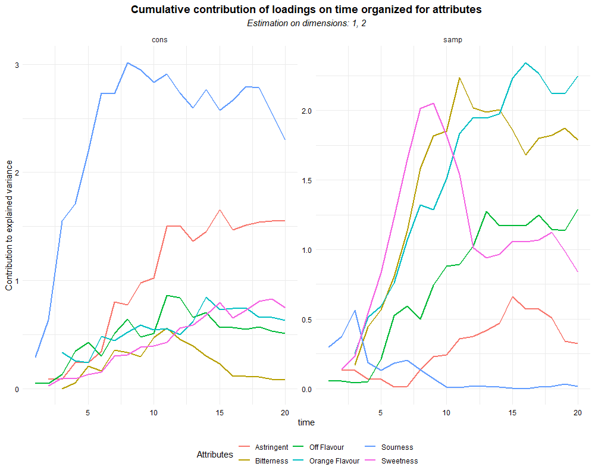

# ASCATCATA package

<!-- badges: start -->


<!-- badges: end -->

The goal of ASCATCATA is to allow to apply a multivariate ASCA (ANOVA-Simultaneous Component Analysis) on Temporal-Check-All-That-Apply data.

## Installation

You can install the development version of ASCATCATA like so:

``` r
library(devtools)
devtools::install_github("riccim94/ASCATCATA")
```

## Example

The ASCATCATA package offers a main function to apply an ASCA decomposition across a TCATA dataset. The decomposition applied consists in assuming a gaussian distribution after applying an union scale normalization to the interval considered.

``` r
library(ASCATCATA)
library(tempR)
library(tidyverse)
## basic example code
data <- tempR::ojtcata
```

``` r
#first step consists in wrangle the dataset to put it in long format
# and to mutate in factors the columns "cons" and "samp", and in numeric the column time
data.long <- data %>% gather(time, CATA, 5:25) %>%
mutate(cons = as.factor(cons), samp = as.factor(samp),
time = as.numeric(str_extract(time, "\\d+")))

# then we apply time resolved ASCA decomposition on the dataset.

ASCA_T1 <- ASCATCATA::tcatasca(CATA ~ cons+samp, data = data.long, timecol = "time", attributes = "attribute")
```

``` r
# The results can be representd using biplots

ASCATCATA::plot_ASCA(ASCA_T1)
```


``` r
# There are multiple display options available

ASCATCATA::plot_ASCA(ASCA_T1, density = T, path = F,, path.smooth = F)
```


``` r
# To estimate the variability along time of the attributes we can use the function plot_time_loadings

ASCATCATA::plot_time_loadings(ASCA_T1)
```




``` r
# The function plot_ASCA allows also to apply a hierarchical clustering for the results of the hierarchical clustering and report the results.

ASCATCATA::plot_ASCA(ASCA_T1, h_clus = 2)
```


